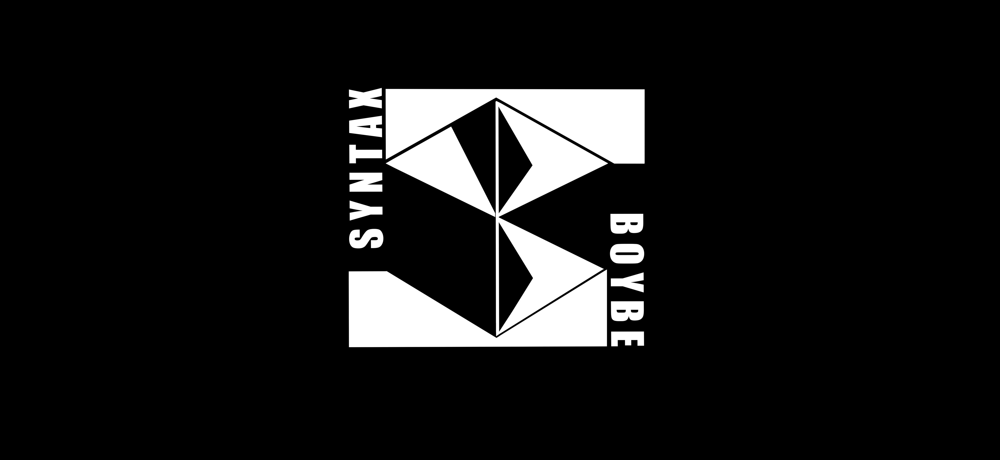

<h1>Hi there  I'm Beboy Eyana | aka SyntaxBoybe <👨‍💻🎮👨‍🌾> </h1>

-   ⚒ I’m currently working on my **Front-End Skills**.
-   🌱 I’m currently learning Laravel and Vanilla JS.
-   💬 Ask me about **HTML, CSS, JavaScript/TypeScript**.
-   🤝 Looking forward to collaborate with other projects.
-   🤔 I’m looking for help with other Web Frameworks and Tools.
-   🎯 Current Goal: Learn, Create, Build, and Deploy projects
-   ⚡ Fun fact: My Personality Type is **NPC**.
-   📫 How to reach me: **beboy.eyana.m@gmail.com**

#### Connect with me:

#### Top Technologies:

